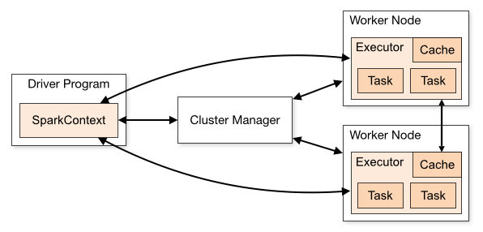

# Spark Architecture:

Apaches sparks performance advantages comes form its unique distributed architecture. Unlike traditional single-node architecture,sparh uses **Driver-exector architecture** where one central coordinator (the driver) manages many distributed workers(executors).

Apache Spark’s performance advantage comes from its distributed execution model. But the same architecture that makes Spark fast is also the root cause of common production issues like OutOfMemory errors, skewed jobs, and long shuffles.


## The Driver Executor Model:

At a high level every spark applciation follows a distributed architecture consisting of two main pieces that communicate with each other.

1. **Driver Program** (The Coordinator/Controller)
2. **Worker Nodes** (Compute resources)

They are connected by **Cluster Manager** which allocates resources.

|Component| Role.                    |Key responsibilities|
|---------|--------------------------|--------------------|
|Driver   | Central Coordinator.     |Converts your code to execution plan, scheules tasks and collects results|
|Cluster Manager|Resource manager|Allocates CPU/Memory , launches executors , monitors cluster health|
|Executors| Distributed Workers| Runs Tasks in Parallet , cache data partitions , report status to driver|

Lets go over these components in detail:

1. **Driver(Master Node)**:
  The driver is the process where you `main()` method runs. It is the control center of your application.

  - Reposibilities
    1. Converts your user code into tasks
    2. Creates the **SparkSession** , the entry point to the cluster.
    3. Constructs a **DAG(Directed Acyclic Graph)** of the Job execution.
    4. Schedules tasks on Executors and monitors there progress.

2. **Cluster Manager**
  The Cluster Manager is an external service that allocates resources across the cluster and manages the lifecyle of Executors. It acts as the intermediary between the Driver and the worker nodes, ensuring efficient resource distribution across applications.

  Spark is agnostic to the underlying cluster manager. It can run on:

  1. Standalone: Spark's simple built-in manager.
  2. YARN: Hadoop's resource manager (common in big data).
  3. Kubernetes: For containerized deployments.
  4. Mesos: An older general-purpose cluster manager.

3. **The Executors(Worker nodes)**:
Executors are distrbuted agents responsible for two things:
**Executing Code** and **Storing data**.

-  Responsibilites:
    1. Run the tasks assigned by the Driver.
    2. Return results to the Driver.
    3. Provide in-memory storage for cached RDDs/DataFrames.
    4. Each application gets its own set of executor processes.


## Driver & Excutor Configuration

Configuring the driver and executor correctly is critical first step in Spark performance tuning. These Properties establish the baseling resources (memory and CPU) available for your job to execute efficiently. Setting them correctly is essential to prevent **OutOfMemory** errors and ensure your cluster is utilized effectively.

### Driver Properties
The Driver needs enough memory to store the DAG, task metadata, and any results collected back to it (e.g., via `.collect()`).

|Property|	Default|	Description|
|-------|---------|-------------|
|`spark.driver.memory`|	1g|Amount of memory to use for the driver process. If your job collects large results, increase this.|
|`spark.driver.cores`|1	|Number of cores to use for the driver process (only in cluster mode). For production jobs, set it to 2-4 (default is 1). This is cheap insurance against stability issues.|

### Executor Properties
Executors do the heavy lifting. Their configuration balances parallelism (cores) against memory capacity.


### What is Parallelism?

In Spark, parallelism defines how many tasks can run at the exact same time across the entire cluster.

It is directly determined by the total number of cores available in your executors.

  * 1 Core = 1 Task = 1 Partition processed at a time.
  * If you have 10 Executors and each has 4 cores , you total parellelism is 40.
  * This means Spark can process 40 partitions of data simulataneously.

  If you have 100 Partitions of data but only 40 cores, Spark will process the first 40 then the next 40 and finally the last 20:

|Property|Default|Description|
|--------|-------|-----------|
|`spark.executor.memory`| 1g|Amount of memory to use per executor process. This is split between execution memory (shuffles/joins) and storage memory (cache).|
|`spark.executors.cores`|1 (YARN), all (Standalone)|The number of cores to use on each executor. Best Practice: Keep this between 3-5 cores for optimal garbage collection (GC) performance.|
|`spark.executor.instances|2|The number of executors to launch for this application (when using static allocation).|

### How a Spark Job Runs (Execution Flow)




When you submit a Spark job (e.g., `spark-submit`), the following sequence occurs:

1. Submission: The Driver starts and connects to the Cluster Manager.
2. Resource Request: The Cluster Manager launches Executors on Worker Nodes.
3. Job Planning (DAG): The Driver converts your code (Transformations & Actions) into a logical graph (DAG).
4. Task Creation: The DAG is converted into physical execution units called Tasks.
5. Scheduling: The Driver sends these tasks to the Executors.
6. Execution: Executors run the tasks and store data in RAM.
7. Result: Results are sent back to the Driver or written to disk/storage.
8. Termination: When `spark.stop()` is called, all executors are terminated and resources released.


### Understanding Jobs, Stages, and Tasks
Spark breaks down work hierarchically:

1. Application: The entire user program built on Spark. Think of this as the "project" – it includes one Driver (manager) and multiple Executors (workers) that stay alive until the application ends.

2. Job: A parallel computation triggered by an Action (e.g., .count(), .collect(), .show()). Each action creates one job. If your code has 3 actions, Spark runs 3 separate jobs.

3. Stage: Jobs are divided into stages based on Shuffle boundaries. A shuffle happens when data must be redistributed across the cluster (like during a groupBy or join). Stages contain tasks that can run in parallel without network shuffles.

4. Task: The smallest unit of work. One task = one transformation applied to one partition of data. If you have 200 partitions, Spark creates 200 tasks per stage. Tasks run independently on Executors.


The Flow:

```
1 Application
  └─ Multiple Jobs (one per Action)
      └─ Multiple Stages (split by Shuffles)
          └─ Multiple Tasks (one per Partition)

```

## Recap

|Term	|Meaning|
|-----|-------|
|Application	|User program built on Spark. Consists of a driver program and executors on the cluster.|
|Driver program	|The process that runs the main() function of the application and creates the SparkSession.|
|Cluster manager|	An external service for acquiring resources on the cluster (e.g., Standalone, YARN, Kubernetes).|
|Worker node|	Any node in the cluster that can run application code.|
|Executor	|A process launched for an application on a worker node that runs tasks and stores data in memory or disk. Each application has its own executors.|
|Task|	The smallest unit of work, sent to a single executor.
|Job |A parallel computation consisting of multiple tasks, triggered by a Spark action (e.g., save, collect). This term appears in driver logs.|
|Stage	|A subset of a job consisting of tasks that can be executed together. Stages are separated by shuffle boundaries (similar to map and reduce stages in MapReduce).|